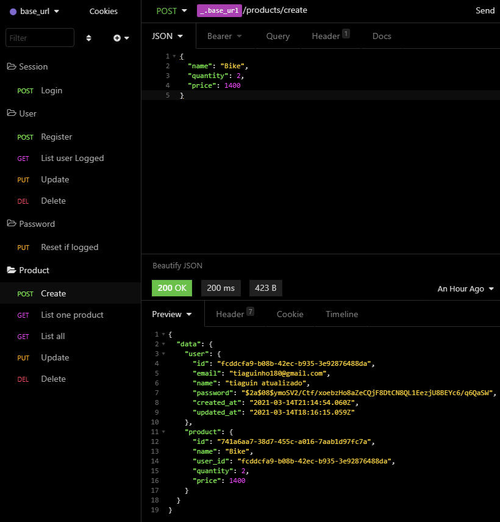

<h1 align="center"> Título </h1>

🔍 Navegação dentro do Readme. 

  
  
  
  
  
  

  

  <h1 id="sobre-o-projeto"> ✅ Sobre o projeto </h1>
  

    Este é um projeto de CRUD simples de usuários e produtos que está sendo feito para por em prática os conhecimentos das tecnologias que domino no backend.
     
    Pretendo ainda adicionar umas novas features, como categorias para os produtos.
  

 

  

 

___

 
  <h1 id="techs">🚀 Tecnologias Utilizadas </h1> 
  

    Utilizei o VsCode para fazer os códigos em NodeJS e Typescript. 
     
    O Insominia é para testar a api feita.
     
    Utilizei o Typeorm, então da para conectar com diversos bancos de dados.
     
    Utilizei o Docker para ajudar na conexão com o banco de dados PostgresSQL.
  

  

    

      ➡
      <a href="https://nodejs.org/en/"> NodeJS</a>
    

    

      ➡
      <a href="https://www.typescriptlang.org"> Typescript</a>
    

    

      ➡
      <a href="https://www.typescriptlang.org"> PostgresSQL</a>
    

    

      ➡
      <a href="https://insomnia.rest"> Insominia</a>
    

    

      ➡
      <a href="https://www.docker.com"> Docker</a>
    

    

      ➡
      <a href="https://code.visualstudio.com"> VsCode</a>
    

  

 

 

___

  <h1 id="rodar-projeto">💻 Como rodar o projeto na sua máquina </h1>
  
➡ Instalar o NodeJS na sua máquina. 

  
➡ Se quiser utilizar o Docker e insominia, instale-os também e leia as documentações para entender como funciona o processo, senão, utilize o próprio banco de dados para substituir o <strong>Docker</strong> e para substituir o <strong>insominia</strong>, utilize outro software parecido.

  
➡ Ao instalar tudo necessário, abra uma pasta em seu editor de código e vá no cmd dele(no Vscode o nome é "terminal") ou abra o cmd da sua máquina, digite e execute: 

  
 

    git clone https://github.com/Tiaguin061/CRUD-basico
  

  
➡ Entre na pasta do projeto(a que acabou de clonar), digite e execute: 

  

    yarn
  

  
➡ Para ver os comandos disponíveis e dependências instaladas, vá no arquivo package.json. Por fim, para iniciar o servidor, vá em seu editor de código e vá no cmd dele(no Vscode o nome é "terminal") ou abra o cmd da sua máquina, digite e execute: 

  

    yarn dev:server 
  

  
❤ Pronto, seu projeto está certinho para funcionar.

 

___

  <h1 id="contribuir">🔗 Como contribuir com o projeto</h1>
  

    
 1° - Faça um Fork do repositório; 

    
 2° - Clone o repositório; 

    
 3° - Crie uma branch com a sua feature; 

    
 4° - Faça um commit bem descritivo com suas mudanças; 

    
 5° - Dê 'Push' a sua branch; 

    
 6° - Ir em Pull Requests do projeto original e criar uma pull request com o seu commit; 

    

     ➡ Caso tenha dúvidas sobre como criar um pull request, 
      <a 
        href="https://docs.github.com/pt/github/collaborating-with-issues-and-pull-requests/creating-a-pull-request"> clique neste link.
      </a>  
    

  

 

___

  <h1 id="rede-social">📱 Minhas redes sociais</h1>
  
 Eu me chamo Tiago Gonçalves, abaixo deixo os links das minhas principais redes na qual participo.
  

  
  
  
  

 

___

  <h1 id="license">✔ Licença</h1>
  
  Este projeto está sobre Licença MIT, veja: 

  

